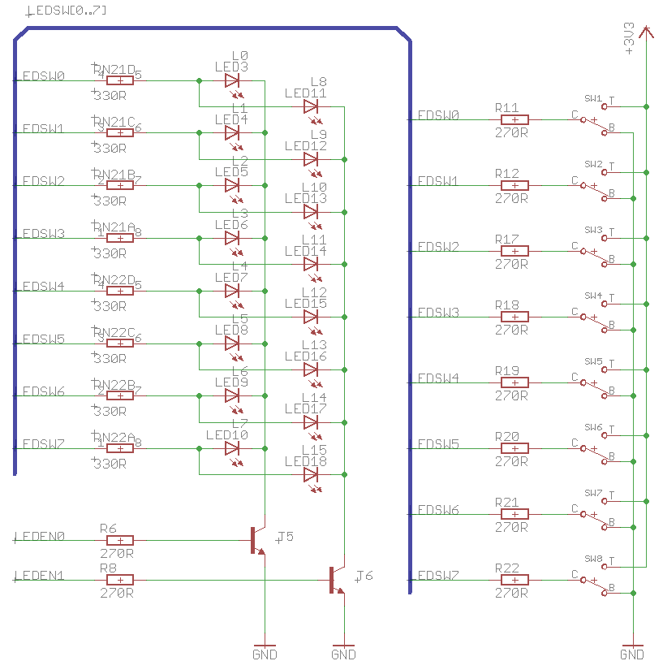

# led_switch_mux

A demo of a silly way of saving IO pins on FPGAs dev boards!

One can use a single array of pins for both driving LEDs and reading switch states!

## External schematic

- `LEDSW[0..7]` - LED and Switch commons
- `LEDEN[0..2]` - LED row enables
- This schematic's resistor values are probably not ideal.
    - Switch resistor values seem too low!
    - Still, it should be quite well-explanatory.

## How it works

- Reading switches
    - Keep all `LEDEN` pins low, disabling current flow through the LEDs, keeping them switched off.
    - Switch values may be readily observed on `LEDSW` lines
- Driving LEDs
    - Set one `LEDEN` pins high, enabling that row of LEDs
    - Drive `LEDSW` to desired pattern
    - Switches are effectively isolated from driving LEDs by the `R[11..12,17..22]` resistors
        - **These resistor values may yet be increased; I'm not sure why they're so low here!**
            - 12 mA?!
            - It's probably quite sane to use 2.7k resistors or larger instead!
    - FPGA pins will drive harder than what the switches provide, overriding their influence.
    - Other than that, it's usual LED multiplexing!

## How to use the core

Simply instantiate it as is, after fixing the code someday.

## Tests

Currently, there are none. :)

### Generics

- `led_rows`
    - represents the number od LED driver pins (`LEDEN`)
- `led_columns`
    - represents the number of switch/LED common pins (`LEDSW`)
- `led_period`
    - sets the time for which the LEDs stay on before switching to the next row
    - value is in clock cycles
- `switch_period`
    - sets the time during which switches are registered
    - value is in clock cycles

### Ports

- in `clk`
    - main system clock, posedge
- in `srst`
    - synchronous reset
- out `switches`
    - registered switch states
- in `leds`
    - led states to display
    - all rows in one bundle
        - row 0: 7..0
        - row 1: 15..8
        - ...
- inout `ledsw`
    - tristate `LEDSW` bus as in the schematic
- out `leden`
    - LED driver outputs, `LEDEN` in the schematic